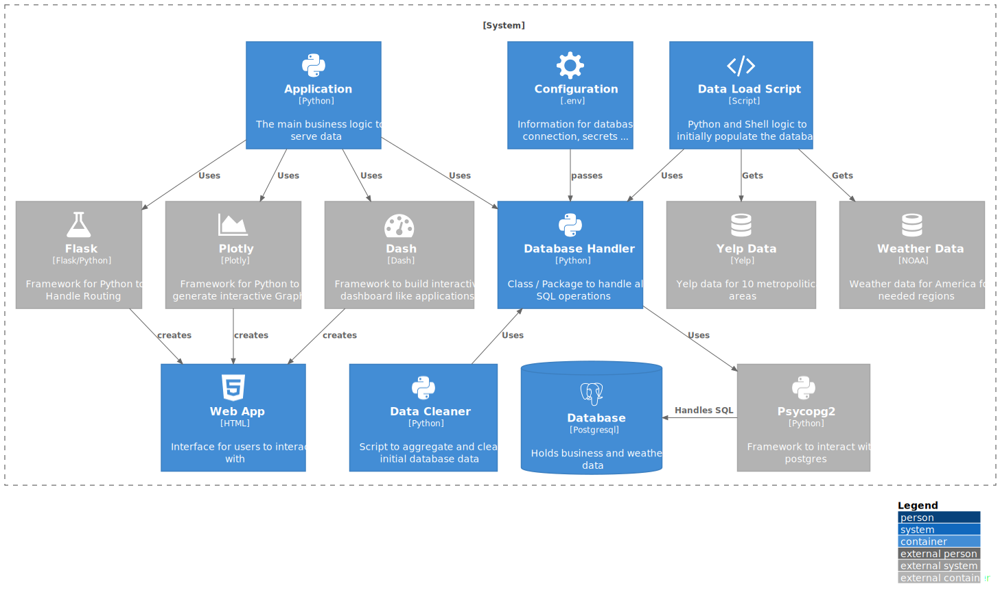

# Project Synchro Info


#### The Project for the Info Sync Module

<!-- TOC -->

- [Project Synchro Info](#project-synchro-info)
- [Basic Information](#basic-information)
  - [Project Structure](#project-structure)
- [Setting up the Project](#setting-up-the-project)
  - [How to Start](#how-to-start)
  - [Linting](#linting)
  - [Testing](#testing)
  - [Running Postgres with Docker](#running-postgres-with-docker)
  - [Postgres on the VM](#postgres-on-the-vm)
    - [Enabling Remote Access](#enabling-remote-access)
    - [Use .sql files](#use-sql-files)
    - [Procedure with too Large Files](#procedure-with-too-large-files)
  - [Environment Variables](#environment-variables)
  - [Run the SQL Setup Scrips](#run-the-sql-setup-scrips)
  - [Run the SQL cleanup Scripts](#run-the-sql-cleanup-scripts)
  - [Run the SQL optimization Scripts](#run-the-sql-optimization-scripts)
- [A Little Dive into the Data](#a-little-dive-into-the-data)
  - [Structure of the data](#structure-of-the-data)
    - [Yelp Data](#yelp-data)
    - [NOAA Climate Data](#noaa-climate-data)
- [Project App Information](#project-app-information)
  - [Programm Schema](#programm-schema)
  - [API Schema](#api-schema)
  - [Dash App Structure](#dash-app-structure)
  - [Setting up the Dash App](#setting-up-the-dash-app)
  - [Ressources for Dash/Plotly/Flask](#ressources-for-dashplotlyflask)

<!-- /TOC -->

# Basic Information

This is the Semester Project of Group 3 from the Data Science Master synchronization module for Computer Science.
The Idea was to use the [Yelp Dataset](https://www.yelp.com/dataset) combined with the [NOAA Weather Dataset](https://www1.ncdc.noaa.gov/pub/data/ghcn/daily/) to investigate relations between weather and customer reviews.
The precise goal was not defined, since in most DS projects the outcome ist not quite clear.
Our groups goal was to create an app for users to interact with, explore the data for the different states and city clusters and get insight into that data.
The gained insights should help the user decide on their business model. This includes the kind of the business as well as geographical location and factors like price range and open time / span.

## Project Structure

The project structure devides into different parts:

- `data_scripts` Notebooks and Python Scripts to do EDA and explore the default data / do some basic testing.
- `sql_setup` Shell Scripts and Python Scripts to read in the needed data into the sql Database. The Yelp Dataset needs to be downloaded via hand, since a consent is needed.
- `sql_cleanup` SQL and Python code to add features to the Database and clean up inconsistent data.
- `sql_optimization` SQL and Python code to add additional features and materialized views for querry optimization.
- `result_of_analysis` Notebooks for EDA of the final Database Data and to pre draft the plots for the app.
- `nlp` Script to build a NLP model of the reviews and apply it to the tips text-
- `test` Folder for test Scripts.
- `src` Folder for all application logic.
- `doc` Folder for diagrams, sql Schema, PowerDesigner Files.
- `index.py` Entrypoint of the app.
- `docker-compose.yml` Docker file to run the app via docker.
- `.env.example` Example .env file for the project. Use .env.prod. for docker and .env for the plain index.py.

# Setting up the Project

## How to Start

Run this to install requirements:

```shell
pip install -r requirements.txt
```

When working in a venv, you can also freeze your requirements (when new ones were added) with:

```shell
pip-chill > requirements.txt
```

## Linting

The CI/CD pipeline will run the linting checks on GitLab.
You can run the linter locally with either:

```shell
flake8 --max-line-length=120 src
pylint -d C0301,C0114,C0116 src
python -m mypy src
```

For the respective linting module and quality check the code.

## Testing

The CI/CD pipeline will run pytest after the linting tests on GitLab.
In addition, the code coverage report (how many lines of code are tested) will be generated and an according badge will be created for the readme to represent the quality of the code.

You can also run pytest (after installing the dependencies) locally with:

```shell
pytest --cov=src
or
pytest --cov=src --junitxml=report.xml
```

to run tests with or without an additional report in XML.

Due to the current folder structure, all source code should be located in the `src` folder, all tests should be located in the `test` folder. Pytest will recognize any module starting with `test_` or ending with `_test`. The same applies for the testing function within these files, since there may also exist helper function. These should not directly be executed for testing purposes in the test modules. It is also worth mentioning that when adding another folder path to the tests, this folder needs to contain an empty `conftest.py` file. This way pylint will recognize this folder and add it to its python path. The module and its functions can then be imported with the common pattern `modulefolder.module.function` within the tests.

## Running Postgres with Docker

This repo contains a `docker-compose-postgres.yml` file to easily set up a Postgres database anywhere, as long as Docker (Windows) or also Docker-Compose (Linux) is installed. To set up the container and get it running just execute:

```shell
docker-compose -f docker-compose-postgres.yml up
```

This will set up the Postgres in a docker on your localhost. It uses the default port (`5432`) with the user/password `postgres/postgres` and the database `docker_postgres`.

You can also enter the containers shell to execute psql:

```shell
docker exec -it [containername | containerId] bash
su [postgres | username]
psql
```

You can also use another shell instead of bash.

## Postgres on the VM

The VM provided is a CentOS GNU/Linux distribution. Here, yum is used as package manager. The latest Postgresql12 image was used for the Database. Setting up a user / database is identical to the process described in the script for our own VM.

### Enabling Remote Access

First the postgres settings need to be changed. They can be found at : `/var/lib/pgsql/data/postgresql.conf` and `/var/lib/pgsql/data/pg_hba.conf`. In the first file, set `listen_addresses = '*'`. In the second file append the following line: `host all all 0.0.0.0/0 trust` or just add your specific ips if you dont want acced for everyone.

### Use .sql files

To run / execute .sql files you simply have to run:

```shell
psql -U postgres -d docker_postgres -f /doc/basic_schema.sql
```

Where the flags are for:

- **-U**: user of the database
- **-d**: database to use
- **-f**: path to the sql file

You can also use the PgAdmin Interface and import the SQL files there to execute over the GUI.

### Procedure with too Large Files

Some of the .json files are quite large (6 GB) and will probably not fit within one read into Python (the 6 GB file needed more than 24 GB RAM during the `pd.read_csv()` procedure). One possibility is to split the JSON files on linux:

```shell
split -l 1000000 -a 1 'name_of_json' 'output_name_'
```

This will generate a suffix of one letter, starting with a (so output_name_a, output_name_b, ...) and each file containing one million rows.

## Environment Variables

The `.env.example` displays an example of all needed variables. In case of the Postgres docker container they can stay the same. Be sure to create an `.env` file with the corresponding variables or an `.env.prod` for the docker of the later run app.

## Run the SQL Setup Scrips

In the `sql_setup` folder are multiple scripts (Python and Shell) to easen the data download and to populate the DB. To download the yelp dataset the user needs to give his consent, therefore it can not be done via a shell script. Once all the files (noaa over scripts) and yelp unzipped (you can use `tar xvzf 'file.tar.gz'`) you can run `slice_big_json.sh` to split the large JSON (user and reviews) into smaller chunks of data. Otherwise, the VM will run out of ram ¯\\\_(ツ)\_/¯. Finally run you can run `python populate_db.py`. You need to have all dependencies installed with pip. This process will take some time. To additionally pipe the output to a file, you can write it to console and file in paralle with:

```shell
(unbuffer) python populate_db.py |& tee -a writelog.txt
```

The unbuffer part makes every print to the terminal instant and not buffering it until a certain size is reached. You could also try setting `export PYTHONUNBUFFERED=1` to explicitly tell Python not to buffer stout and sterr.

## Run the SQL cleanup Scripts

The `clean_and_link.py` script is quite similar to the setup script. It can be found in the `sql_cleanup` folder. It will fit the business data to given cluster amount (default 10) and enters + updates the data in the database.
The execution is similar to above:

```shell
(unbuffer) python clean_and_link.py |& tee -a writelog.txt
```

The same goes to the other files. Currently there are `load_additional_stations.py`, `aggregate_cluster_weather.py`, `rename_cities.py` and `sentiment_tips.py` (in nlp folder) for further data loading / aggregation.

## Run the SQL optimization Scripts

Within the `sql_optimzation` folder are additional sql and python files to further improve performance of the querries.
The can be executed identical to all other scripts.

# A Little Dive into the Data

## Structure of the data

### Yelp Data

The data can be found at the [Yelp Dataset site](https://www.yelp.com/dataset). Broken down, the dataset consists of five different types of JSON data. `business.json`, `review.json`, `user.json`, `checkin.json`, `tip.json` and `photo.json`. The first two data sets seem to hold the most important data.

The following table shows the important attributes from `business.json` that we collectively think are relevant for our databank design:

| Attributes   | Description                                      |
| ------------ | ------------------------------------------------ |
| business_id  | Would be Primary key for the business            |
| city         | city, where business is located                  |
| state        | US-State, where city is located                  |
| postal code  | postal code of business                          |
| latitude     | gives the position away                          |
| longitude    | gives the position away                          |
| stars        | average number of stars received by Yelp-Users   |
| review count | number of reviews received                       |
| attributes   | infrastructure and services provided by business |
| categories   | niches or categories of business/business type   |
| hours        | opening hours of business                        |

<br/>

### NOAA Climate Data

The data can be found at the [site of the NOAA](https://www1.ncdc.noaa.gov/pub/data/ghcn/daily/). The [Readme](https://www1.ncdc.noaa.gov/pub/data/ghcn/daily/readme.txt) gives an overview of the structure of the `.dly` files, containing the weather data and first steps for downloading. Further specifics to the data would be too extensive for this documentation and should be looked up in the readme file.

<br/>

The file structure is according to this schema:

| Variable | Columns | Type      |
| -------- | ------- | --------- |
| ID       | 1-11    | Character |
| YEAR     | 12-15   | Integer   |
| MONTH    | 16-17   | Integer   |
| ELEMENT  | 18-21   | Character |
| VALUE1   | 22-26   | Integer   |
| MFLAG1   | 27-27   | Character |
| QFLAG1   | 28-28   | Character |
| SFLAG1   | 29-29   | Character |
| VALUE2   | 30-34   | Integer   |
| MFLAG2   | 35-35   | Character |
| QFLAG2   | 36-36   | Character |
| SFLAG2   | 37-37   | Character |
| .        | .       | .         |
| .        | .       | .         |
| .        | .       | .         |
| VALUE31  | 262-266 | Integer   |
| MFLAG31  | 267-267 | Character |
| QFLAG31  | 268-268 | Character |
| SFLAG31  | 269-269 | Character |

<br/>

The station file is according to this schema:

| Variable     | Columns | Type      |
| ------------ | ------- | --------- |
| ID           | 1-11    | Character |
| LATITUDE     | 13-20   | Real      |
| LONGITUDE    | 22-30   | Real      |
| ELEVATION    | 32-37   | Real      |
| STATE        | 39-40   | Character |
| NAME         | 42-71   | Character |
| GSN FLAG     | 73-75   | Character |
| HCN/CRN FLAG | 77-79   | Character |
| WMO ID       | 81-85   | Character |

<br />

# Project App Information

In this section, more detailed information about the project / application is given.

## Programm Schema

The Application runs on the CentOS VM. There you can find the Postgres DB and the Application running for the user to interact with. The programmer can set the Database properties in the `.env` file, so sensible data like passwords are not exposed anywhere else. An even better way could be using a Docker Container with the appropriate environment variables to get even rid of the .env file locally. The user is served an interface where he can interact with the Database over a GUI which displays for example checkboxes, Dropdowns and Plots:


## API Schema

There exist two scripts to initially populate the database, as well as clean the inserted data and generate further links (seperate business into clusters, link each cluster / business to a weather station, ...). The Database Handler (DH) is the central piece to interact with the database. It uses to psycopg2 Framework to establish a connection over Python. The configurations are provided over the `.env` file. The different Scripts and Programms uses the DH to have access to a uniformly API to execute querries and make a change of the framework (for example from psycopg2 to psycopg3 or sqlalchemy) also possible and easily. All according SQL logic (Querry Strings) are abstracted into seperate methods of the Database Executor (DE) class to have a good seperation of Database commands and the rest of the Python code.

The main application also utilises the DH package to interact with the database. With the help of the Flask, Dask and Plotly frameworks an interactive and user friendly interface is generated, which can be accesses on the public port of the VM:



## Dash App Structure

All the single pages will be linked over the `index.py` file, where the pages and their callbacks (if split up to multiple files) are imported.
Within the `src` folder, there are the needed modules. The single pages can be either a single file or packed into an own module folder seperated into the view and the callbacks (or even more granular), depending on the code length.
If the view is seperated into callback and views, it is important to also import the callbacks within the `index.py`.
The `helper` module contains reoccuring html elements for easy reuse, the `database_handler` module holds all relevant querries and return the appropriate data (mostly pd.DataFrames or single values).

## Setting up the Dash App

There is a `DOCKERFILE.dash` as well as the `docker-compose.yml` file to set up the dash application anywhere via docker-compose.
The `.env.prod` file needs to contain the credentials for the database according to the `.env.example` file. Then just run:

```shell
docker-compose [-p yourcustomname] up [--build]
```

And docker-compose will take care of the container and setting up process. The entrypoint is the `index.py` file.
The internal docker Port 8050 will get mapped to the VM port 80.
The -p flag and --build flag are optional and only needed if you run multiple compose files in one project or made crucial changes to the config.
It is important to note that currently no proxy (like nginx) or ssl certificates are used, since this app was only deployed for iternal showcases and not for production.

## Ressources for Dash/Plotly/Flask

Here is a list of the docs / articles which can be quite usefull:

- [Plotly Express docs + examples](https://plotly.com/python/plotly-express/#scatter-line-area-and-bar-charts)
- [Dash Core Components docs + examples](https://dash.plotly.com/dash-core-components)
- [Visualization with Plotly.Express: Comprehensive guide](https://towardsdatascience.com/visualization-with-plotly-express-comprehensive-guide-eb5ee4b50b57)
